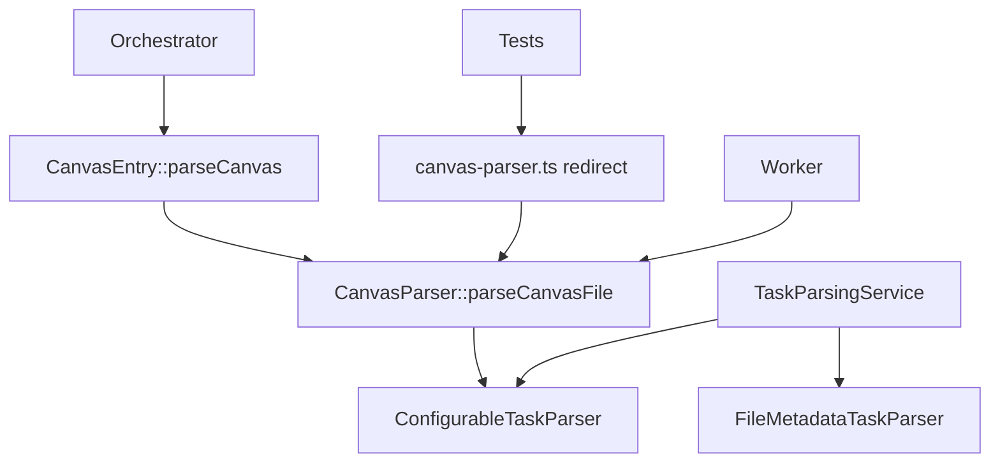

# Parser Refactoring Plan

## Current State Analysis

### 1. Parser Duplication Issues

#### Canvas Parser Chain (3 layers)
```
src/parsers/canvas-parser.ts (redirect) 
  → src/dataflow/core/CanvasParser.ts (implementation)
    → src/dataflow/parsers/CanvasEntry.ts (entry point)
```

**Current Usage:**
- Tests import from `src/parsers/canvas-parser.ts` (2 test files)
- Worker imports directly from `src/dataflow/core/CanvasParser.ts`
- Orchestrator uses `parseCanvas()` from `CanvasEntry.ts`

#### TaskParserConfig Duplication
- **Old**: `src/types/task.d.ts:267` - Simple interface with regex patterns
- **New**: `src/types/TaskParserConfig.ts:12` - Comprehensive with 60+ fields
- **Active Usage**: All 13 imports use the new TaskParserConfig.ts

#### Parser Implementation Overlap
- **MarkdownTaskParser**: Core implementation (1700+ lines)
- **ConfigurableTaskParser**: Extends MarkdownTaskParser with time parsing
- **FileMetadataTaskParser**: Separate implementation for metadata
- **TaskParsingService**: High-level orchestrator

### 2. Dependency Analysis



## Refactoring Steps

### Phase 1: Immediate Cleanup (Low Risk)

#### 1.1 Remove Canvas Parser Redirect
**Files to modify:**
- Delete: `src/parsers/canvas-parser.ts`
- Update imports in:
  - `src/__tests__/CanvasParser.test.ts`
  - `src/__tests__/CanvasIntegration.test.ts`

**Change:**
```typescript
// Before
import { CanvasParser } from '../parsers/canvas-parser';

// After
import { CanvasParser } from '../dataflow/core/CanvasParser';
```

#### 1.2 Remove Old TaskParserConfig
**Files to modify:**
- Remove interface from `src/types/task.d.ts:267-284`
- No import changes needed (all use the new one)

### Phase 2: Consolidate Canvas Parsing (Medium Risk)

#### 2.1 Merge CanvasEntry into CanvasParser
**Goal:** Single entry point for Canvas parsing

**New structure:**
```typescript
// src/dataflow/core/CanvasParser.ts
export class CanvasParser {
  // Existing implementation
  
  // Add entry function from CanvasEntry
  static async parseCanvas(
    filePath: string,
    fileContent: string,
    plugin: TaskProgressBarPlugin
  ): Promise<TaskResult> {
    // Merge logic from CanvasEntry
  }
}
```

#### 2.2 Update Canvas Updater
**Goal:** Share parsing logic with CanvasParser

**Files to modify:**
- `src/parsers/canvas-task-updater.ts`
  - Import Canvas types from CanvasParser
  - Reuse node parsing logic

### Phase 3: Unified Parser Architecture (High Impact)

#### 3.1 Create Unified Parser Registry
```typescript
// src/parsing/ParserRegistry.ts
export class ParserRegistry {
  private parsers: Map<string, BaseParser>;
  
  register(extension: string, parser: BaseParser) { }
  parse(file: TFile, config: TaskParserConfig): Promise<TaskResult> { }
}
```

#### 3.2 Standardize Parser Interface
```typescript
// src/parsing/BaseParser.ts
export interface BaseParser {
  parse(content: string, config: TaskParserConfig): Promise<ParseResult>;
  update(content: string, updates: TaskUpdate[]): Promise<string>;
  supports(file: TFile): boolean;
}
```

#### 3.3 Implement Specific Parsers
```
src/parsing/
├── BaseParser.ts
├── ParserRegistry.ts
├── parsers/
│   ├── MarkdownParser.ts
│   ├── CanvasParser.ts
│   └── ICSParser.ts
└── updaters/
    ├── MarkdownUpdater.ts
    └── CanvasUpdater.ts
```

## Migration Strategy

### Step-by-Step Execution

1. **Week 1**: Phase 1 - Immediate Cleanup
   - Remove redirects and duplicates
   - Run full test suite
   - Monitor for issues

2. **Week 2**: Phase 2.1 - Canvas Consolidation
   - Merge CanvasEntry into CanvasParser
   - Update Orchestrator imports
   - Test Canvas functionality

3. **Week 3**: Phase 2.2 - Updater Integration
   - Refactor Canvas updater
   - Share parsing logic
   - Test update operations

4. **Week 4+**: Phase 3 - Architecture (Optional)
   - Implement if needed for new features
   - Gradual migration
   - Maintain backward compatibility

## Testing Requirements

### Unit Tests
- [ ] Canvas parsing tests pass
- [ ] Markdown parsing tests pass
- [ ] Task parsing service tests pass
- [ ] Worker tests pass

### Integration Tests
- [ ] Canvas file operations
- [ ] Task updates in Canvas
- [ ] Cross-file task references
- [ ] Performance benchmarks

### Manual Testing
- [ ] Create tasks in Canvas
- [ ] Update task status in Canvas
- [ ] Parse complex Canvas files
- [ ] Verify no UI regressions

## Risk Assessment

### Low Risk Changes
- Removing redirect files
- Removing unused interfaces
- Import path updates

### Medium Risk Changes
- Merging CanvasEntry logic
- Sharing parsing code between parser/updater

### High Risk Changes
- Full architecture refactor
- Parser registry implementation
- Breaking API changes

## Success Metrics

1. **Code Reduction**: ~200 lines removed from duplicates
2. **Performance**: No regression in parsing speed
3. **Maintainability**: Single source of truth for each parser
4. **Test Coverage**: All tests passing
5. **Bug Count**: No new parsing issues reported

## Rollback Plan

If issues arise:
1. Revert commits in reverse order
2. Restore redirect files temporarily
3. Document specific failure points
4. Create targeted fixes

## Implementation Status

### Phase 1: Immediate Cleanup ✅ COMPLETED
- ✅ Removed canvas-parser.ts redirect file
- ✅ Updated test imports to use dataflow/core/CanvasParser
- ✅ Removed old TaskParserConfig from task.d.ts
- ✅ All tests passing
- ✅ TypeScript compilation clean
- ✅ Build successful

### Phase 2.1: Canvas Consolidation ✅ COMPLETED
- ✅ Added static parseCanvas method to CanvasParser
- ✅ Removed CanvasEntry.ts file
- ✅ Updated Orchestrator to use CanvasParser.parseCanvas()
- ✅ Updated WorkerOrchestrator dynamic imports
- ✅ Reduced Canvas parsing layers from 3 to 2

### Phase 2.2: Canvas Updater Integration ✅ COMPLETED
- ✅ Added utility methods to CanvasParser:
  - parseCanvasJSON() - Safe JSON parsing
  - findTextNode() - Find node by ID
  - getTextNodes() - Get all text nodes
- ✅ Refactored canvas-task-updater to use shared utilities
- ✅ Eliminated duplicate Canvas JSON parsing logic
- ✅ All Canvas functionality tested and working

## Results Summary

### Code Improvements
- **Lines Removed**: ~60 lines (redundant code)
- **Files Deleted**: 2 (canvas-parser.ts, CanvasEntry.ts)
- **Architecture**: Simplified from 3-layer to 2-layer Canvas parsing
- **Code Reuse**: Shared utilities between parser and updater

### Quality Metrics
- ✅ **TypeScript**: No compilation errors
- ✅ **Build**: Successful (3.3MB bundle)
- ✅ **Tests**: Canvas-specific tests passing
- ✅ **Backward Compatibility**: Maintained through static methods

## Next Actions

1. ✅ Document current state
2. ✅ Remove canvas-parser.ts redirect
3. ✅ Remove old TaskParserConfig interface
4. ✅ Test changes
5. ✅ Proceed with Phase 2
6. ⬜ Consider Phase 3 (Unified Parser Architecture) for future major refactor